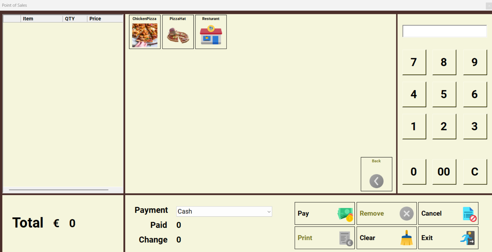
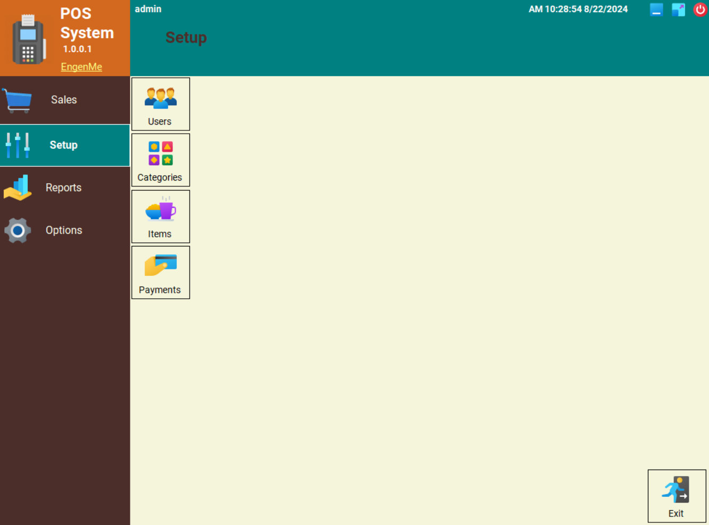

# Contact Management System

## Overview

The Restaurant Point of Sale (POS) System is a C# application developed using Windows Forms and ASP.NET. It streamlines restaurant operations by managing sales, user authentication, table reservations, and reporting. The system supports CRUD operations for users, categories, items, and payments, ensuring robust security and permissions.

<div>
  
  
</div>

## Setup Instructions

### Prerequisites

- .NET Framework compatible with the project SQL Server.
- SQL Server.

### Setup

1. **Clone the Repository**

```bash
git clone https://github.com/EngenMe/RestaurantPOSSystem.git
cd RestaurantPOSSystem
```

2. **Restore the Database**

Before running the application, restore the provided `DB_POS.bak` file into your SQL Server instance:

Open SQL Server Management Studio (SSMS).
Right-click on the `DB_Backup` folder and select Restore Database.
Choose Device and browse to select the `DB_POS.bak` file from the repository.
Follow the prompts to restore the database as `DB_POS`.

3. **Configure the Connection String**

Open the `clsConnectionParameters.cs` file and update the `ConnectionString` to match your SQL Server configuration:

```bash
public static string ConnectionString = "Server=.;Database=DB_Contacts;User Id=sa;Password=sa123456;";
```

4. **Build and Run**

- Open the solution in Visual Studio (or your preferred C# IDE).
- Build the project to restore dependencies.
- Run the application to start using the POS system.

Ensure the database named `DB_Contacts` exists, or create it with the appropriate schema.

## Features

- Sales Management: Process transactions, calculate payments, and print receipts.
- User Authentication: Secure login system with role-based permissions.
- Table Reservations: Manage and visualize table bookings.
- Reporting Dashboard: Generate and view detailed sales reports.
- CRUD Operations:
    - Users: Add, update, and manage user accounts.
    - Categories: Manage product categories.
    - Items: Manage menu items and inventory.
    - Payments: Handle payment processing and logging.

## Contributing

Feel free to fork the repository and submit pull requests for any improvements or bug fixes.

## License

This project is licensed under the MIT License - see the **`[LICENSE](LICENSE)`** file for details.

## Acknowledgments

**`[ADO.NET Documentation](https://docs.microsoft.com/en-us/dotnet/framework/data/adonet/)`**
**`[SQL Server Documentation](https://docs.microsoft.com/en-us/sql/sql-server/)`**